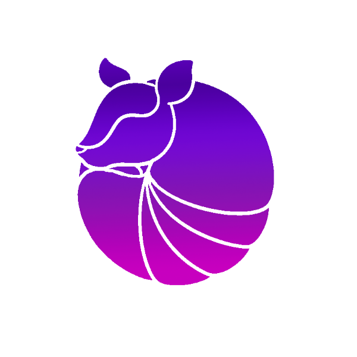

<h1 align="center">SquidGamesLauncher</h1>

#### [
]() *(Un launcher para jugar a SquidGames)*
[
]()

[
]()

---
### **<ins>
Condiciones de uso :
**
- Para utilizar el código debe bifurcar el proyecto
- Para utilizar el código, éste debe ser público en todo momento

---

### **<ins>
Funciones del launcher :
**

- ✅ Actualizaciones automaticas

- 🔴 Modo mantenimiento

- 🔒 Authentification Microsoft.

- 🏴‍☠️ Authentification Crack.

- ⛏️ Soporte a versiones de minecraft 1.0 > 1.19.x.

- 📦 Soporte de Mods Forge (Pas les MCP)
 
- 📰 Noticias en el launcher.

- 🚹 Gestionar skins solo premiun(beta).

- ⚙️ Gestión intuitiva de los ajustes, incluido un panel de control Java.

- 🟢 Estatus del server completo.

    - Operativo o fuera de línea.
    
    - Número de jugadores conectados.

- ☕ Installation de Java automatico (desde las librerias originales).

    - Si tiene instalada una versión incompatible de Java, le instalaremos la correcta.
    
    - No es necesario tener Java instalado para ejecutar el lanzador.

Esta lista no es exhaustiva. Instale el lanzador para ver de qué es capaz.

¿Le gusta el proyecto? ¡Deja una estrella ⭐ en el repo!

---
### **<ins>
Descargar :
**

Puede descargar el lanzador desde la página [Releases GitHub](https://github.com/Hypnos0110/SquidGamesLauncher/releases).

Plateformes supportées :

- Windows 
- Linux
- MacOS

Si realiza la descarga desde Releases, seleccione el instalador para su sistema.

 Plateforme | Fichier |
| -------- | ---- |
| Windows x64 | `SquidGames-Launcher-win-x64.exe ` |
| macOS x64 | `SquidGames-Launcher-mac-x64.dmg` |
| macOS arm64 | `SquidGames-Launcher-mac-arm64.dmg` |
| Linux x64 | `SquidGames-Launcher-linux-x86_64.AppImage` |

---

 

Si te gusta este proyecto y quieres ayudar a desarrollarlo, puedes hacer una donación en [Paypal](http://paypal.me/ricardobevans).

Si tienes alguna pregunta, problema o sugerencia, no dudes en unirte a nuestro discord:

 

[
](https://discord.io/SquidGames) 
---

 
 

[
]() *Creado por HypnoStudios*  

